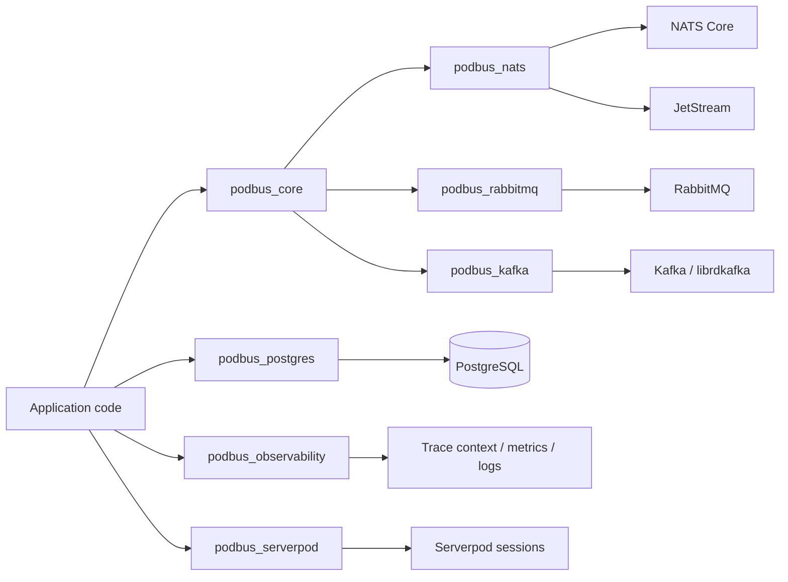

<p align="center">
  
</p>

<p align="center">
  <strong>Messaging, durable jobs, recovery, and database-backed delivery patterns for Dart.</strong><br />
  One API where the semantics are genuinely shared. Explicit capabilities where brokers differ.
</p>

<p align="center">
  <a href="https://github.com/eukalpia/PodBus/actions/workflows/ci.yml"></a>
  <a href="https://github.com/eukalpia/PodBus/actions/workflows/fault-injection.yml"></a>
  <a href="https://github.com/eukalpia/PodBus/actions/workflows/stress.yml"></a>
  <a href="https://github.com/eukalpia/PodBus/actions/workflows/soak.yml"></a>
  <a href="https://github.com/eukalpia/PodBus/actions/workflows/compatibility.yml"></a>
  <a href="https://github.com/eukalpia/PodBus/actions/workflows/security.yml"></a>
  <a href="LICENSE"></a>
  
  
</p>

PodBus is a framework-neutral Dart workspace for event-driven services. It provides publish/subscribe, request/reply, durable workers, retries, dead-letter routing, typed envelopes, bounded concurrency, reconnect supervision, health reporting, tracing, PostgreSQL outbox/inbox patterns, and optional Serverpod lifecycle integration.

PodBus is **not a broker**. It runs on top of NATS, JetStream, RabbitMQ, Kafka, and PostgreSQL reliability primitives. It does not pretend those systems have identical guarantees.

> [!IMPORTANT]
> The workspace version is currently `0.1.0-alpha.1`. The repository is undergoing evidence-based beta qualification. NATS Core and JetStream are the reference transports. RabbitMQ is a beta candidate. Kafka remains experimental. Public APIs can still change before a tagged beta.

> [!WARNING]
> PodBus does not claim exactly-once business side effects. Durable processing is at-least-once. Reconnects, consumer restarts, acknowledgement expiry, and ambiguous publish outcomes can produce duplicates. Use an inbox, idempotency key, or domain uniqueness constraint around externally visible effects.

## Why PodBus exists

A typical backend starts with one broker and eventually accumulates several delivery mechanisms:

- low-latency events and request/reply through NATS Core;
- durable jobs through JetStream or RabbitMQ;
- append-only streams through Kafka;
- transactional database publication through an outbox;
- retries, dead letters, tracing, health checks, and graceful shutdown implemented differently in every service.

PodBus centralizes the shared application contract without erasing the transport contract. Applications can inspect capabilities at startup and fail fast when a selected adapter cannot provide a required behavior.

```dart
queue.capabilities.requireAll({
  MessagingCapability.durableJobs,
  MessagingCapability.deadLettering,
  MessagingCapability.gracefulShutdown,
});
```

## Architecture



The workspace is intentionally split so a plain Dart process does not need Serverpod, PostgreSQL, Prometheus, or Kafka unless it chooses them.

## Package map

| Package | Responsibility | Maturity |
| --- | --- | --- |
| `podbus_core` | Contracts, envelopes, codecs, policies, limits, in-memory implementations, reconnect supervision | beta candidate |
| `podbus_nats` | NATS Core events/request-reply and JetStream durable workers | reference |
| `podbus_rabbitmq` | Publisher confirms, routing, durable queues, retries, DLQ, channel-failure propagation | beta candidate |
| `podbus_kafka` | Producers, consumer groups, offset ordering, native `librdkafka` bindings | experimental |
| `podbus_postgres` | Transactional outbox, inbox leases, persistent idempotency | production evaluation |
| `podbus_observability` | Trace propagation, spans, Prometheus registry, structured logs, health aggregation | production evaluation |
| `podbus_serverpod` | Serverpod startup/shutdown and per-message sessions | production evaluation |

## Transport capability matrix

| Capability | In-memory | NATS Core | NATS JetStream | RabbitMQ | Kafka |
| --- | :---: | :---: | :---: | :---: | :---: |
| Publish / subscribe | ✓ | ✓ | — | ✓ | ✓ |
| Queue groups | ✓ | ✓ | — | ✓ | consumer groups |
| Request / reply | ✓ | ✓ | — | — | — |
| Durable workers | test only | — | ✓ | ✓ | ✓ |
| Delayed retry | process-local | — | broker NAK | TTL / DLX | — |
| Dead-letter handling | ✓ | — | ✓ | ✓ | ✓ |
| Manual acknowledgement / commit | — | — | ✓ | ✓ | ✓ |
| Publisher confirmation | in-process | flush-level | JetStream PubAck | AMQP confirm | delivery report |
| Typed codec registry | ✓ | ✓ | ✓ | ✓ | ✓ |
| Automatic delegate recreation | ✓ | ✓ | ✓ | ✓ | experimental |
| Current status | development | reference | reference | beta candidate | experimental |

### Practical selection guide

- **NATS Core**: low-latency events, queue groups, and request/reply where persistence is not required.
- **NATS JetStream**: durable workers, explicit consumer state, acknowledgement windows, redelivery, and lightweight broker topology.
- **RabbitMQ**: queue-oriented workloads, routing, publisher confirms, prefetch, TTL/DLX retry topology, and broker-managed dead letters.
- **Kafka**: append-only event streams and consumer groups where partition and offset semantics are central. The current PodBus adapter remains experimental.
- **PostgreSQL outbox**: atomic business-data change plus later broker publication.

## Quick start

Packages are not published to pub.dev yet. Pin a commit for reproducible builds.

```yaml
dependencies:
  podbus_core:
    git:
      url: https://github.com/eukalpia/PodBus.git
      ref: <commit-sha>
      path: packages/podbus_core
  podbus_nats:
    git:
      url: https://github.com/eukalpia/PodBus.git
      ref: <commit-sha>
      path: packages/podbus_nats
```

Start NATS with JetStream:

```bash
docker run --rm \
  -p 4222:4222 \
  -p 8222:8222 \
  nats:2.10 -js -m 8222
```

Publish and consume an event:

```dart
import 'package:podbus_core/podbus_core.dart';
import 'package:podbus_nats/podbus_nats.dart';

Future<void> main() async {
  final bus = NatsMessageBus(
    config: NatsMessagingConfig(
      servers: [Uri.parse('nats://localhost:4222')],
    ),
  );

  await bus.connect();

  final subscription = await bus.subscribe<Map<String, Object?>>(
    'lead.created',
    queueGroup: 'crm-workers',
    concurrency: 8,
    handler: (context, lead) async {
      print('received lead ${lead['id']}');
    },
  );

  await bus.publish(
    'lead.created',
    {'id': 42, 'email': 'lead@example.com'},
    headers: MessageHeaders(correlationId: 'request-42'),
  );

  await subscription.close();
  await bus.close();
}
```

## Durable jobs

JetStream and RabbitMQ implement `DurableJobQueue`. A source delivery is acknowledged only after successful handling, or after a retry/dead-letter publication has received the transport's confirmation.

```dart
final jobs = NatsJetStreamJobQueue(
  config: NatsMessagingConfig(
    servers: [Uri.parse('nats://localhost:4222')],
    jetStream: const NatsJetStreamConfig(
      enabled: true,
      streamName: 'PODBUS_JOBS',
      subjects: ['jobs.>'],
      consumerConfig: NatsJetStreamConsumerConfig(
        ackWait: Duration(seconds: 30),
        maxDeliver: 10,
        maxAckPending: 2048,
      ),
    ),
  ),
);

await jobs.connect();

final worker = await jobs.worker<Map<String, Object?>>(
  'jobs.email.welcome',
  durableName: 'welcome-email-v1',
  concurrency: 8,
  retryPolicy: RetryPolicy(
    maxAttempts: 5,
    initialDelay: const Duration(milliseconds: 250),
    maxDelay: const Duration(seconds: 30),
    jitter: 0.2,
  ),
  deadLetterPolicy: const DeadLetterPolicy(
    enabled: true,
    destination: 'jobs.email.welcome.dead',
    includeErrorDetails: true,
    includeOriginalPayload: false,
  ),
  handler: (context, job) async {
    await sendWelcomeEmail(job['email']! as String);
  },
);

await jobs.enqueue(
  'jobs.email.welcome',
  {'email': 'lead@example.com'},
  idempotencyKey: 'welcome-email:lead-42',
);
```

For long-running JetStream handlers, PodBus can send `inProgress` heartbeats so the broker does not redeliver healthy work merely because the handler exceeds the original acknowledgement window.

## Reconnect supervision

`ResilientMessageBus` and `ResilientDurableJobQueue` recreate failed transport clients and restore active subscriptions or workers. The wrapper is framework-neutral and can be used by Serverpod, shelf, CLI daemons, isolates, or a plain `dart:io` process.

```dart
final jobs = ResilientDurableJobQueue(
  factory: () => NatsJetStreamJobQueue(
    config: natsConfig,
    fetchBatchSize: 64,
  ),
  policy: const ReconnectPolicy(
    maxAttempts: 12,
    initialDelay: Duration(milliseconds: 100),
    maxDelay: Duration(seconds: 5),
    backoffMultiplier: 2,
    jitter: 0.2,
    recoveryTimeout: Duration(seconds: 30),
    disposeTimeout: Duration(seconds: 2),
    healthCheckInterval: Duration(seconds: 2),
    healthCheckTimeout: Duration(milliseconds: 750),
  ),
);
```

Recovery behavior:

1. classify the failure as reconnectable or application-level;
2. coalesce concurrent recovery requests;
3. mark health as degraded;
4. bound disposal of the unhealthy delegate;
5. create and connect a replacement;
6. restore active subscriptions or workers;
7. retry the failed operation once;
8. expose the last recovery error and recovery timestamp through health details.

A recovery timeout invalidates the stale recovery future so later operations are not permanently blocked by an abandoned reconnect attempt.

## Delivery contract

| Event | PodBus behavior |
| --- | --- |
| Handler returns successfully | acknowledge or commit the source delivery |
| Handler throws a transient failure | publish/schedule retry, confirm it, then settle the source |
| Handler throws a permanent failure | publish to dead letter, confirm it, then settle the source |
| Retry or DLQ confirmation is ambiguous | leave the source unsettled so the broker can redeliver |
| Connection fails during publish | surface ambiguity or recover according to adapter contract |
| Consumer dies before acknowledgement | broker redelivery is expected |
| Acknowledgement window expires | redelivery is expected unless heartbeat extension succeeds |
| Duplicate delivery | application must deduplicate externally visible effects |
| Database write plus publish | use the PostgreSQL transactional outbox |
| Exactly-once external side effects | not claimed |

### Idempotency is a data boundary

A process-local `Set` is not an idempotency strategy for a replicated service. Use one or more of:

- PostgreSQL inbox leases;
- persistent idempotency keys;
- a domain uniqueness constraint;
- an upstream provider idempotency token;
- a state transition that is safe to repeat.

## Transactional outbox, inbox, and idempotency

A database commit followed by a broker publish is not atomic. `podbus_postgres` records the business change and outgoing message in one PostgreSQL transaction, then relays the message with leases and `FOR UPDATE SKIP LOCKED`.

```dart
final pool = Pool<void>.withUrl(databaseUrl);
final outbox = PostgresOutbox(pool);
await outbox.install();

await pool.runTx((transaction) async {
  await OrderRepository.insert(transaction, order);

  await outbox.enqueue(
    transaction,
    'order.created',
    order.toJson(),
    key: order.id,
    headers: MessageHeaders(correlationId: requestId),
  );
});
```

`PostgresInbox` prevents multiple replicas from performing the same guarded side effect concurrently. `PostgresIdempotencyStore` persists completed operation results across restarts.

See [Reliability](docs/reliability.md) for the full failure model.

## Typed wire contracts

Dart class names are not stable protocol identifiers. PodBus codecs register explicit wire names and schema versions.

```dart
final codecs = MessageCodecRegistry()
  ..register<LeadCreated>(
    messageType: 'crm.lead-created',
    schemaVersion: 2,
    encode: (event) => event.toJson(),
    decode: (json, version) => LeadCreated.fromJson(
      json! as Map<String, Object?>,
      schemaVersion: version,
    ),
  );
```

Consumers receive the incoming version and can upcast old payloads deliberately. Unknown future versions are rejected rather than guessed.

## Observability and health

`podbus_observability` provides:

- W3C `traceparent` and `tracestate` propagation;
- producer, consumer, request, and durable-worker spans;
- bounded-cardinality Prometheus metrics;
- structured JSON logs with credential and personal-data redaction;
- readiness/liveness aggregation;
- degraded recovery states.

```dart
final metrics = PrometheusRegistry(maxSeries: 2000);
final logs = JsonMessagingLogSink(write: stdout.writeln);
final tracer = PodBusTracer(export: spanExporter.add);

final tracedBus = InstrumentedMessageBus(
  delegate: bus,
  tracer: tracer,
  transport: 'nats',
);
```

Do not use message IDs, tenant IDs, emails, or arbitrary routing keys as Prometheus labels. The registry applies an allow-list and a hard series limit because observability should not become the next outage.

## Plain Dart deployment

The repository contains a framework-neutral process proof in `examples/plain_dart_service`:

```bash
docker compose -f docker-compose.integration.yaml up -d nats
bash tool/ci/wait_for_nats.sh

dart run examples/plain_dart_service/bin/main.dart
# Separate process:
dart run examples/plain_dart_service/bin/probe.dart
```

The probe publishes through an independent PodBus client, verifies the worker side effect through HTTP, requests graceful shutdown, and requires the service process to exit successfully.

## Serverpod integration

`podbus_serverpod` opens a fresh Serverpod session for each message and closes it after the handler finishes. Startup is failure-atomic: when registration fails, already-opened transports are closed.

```dart
final messaging = ServerpodMessaging<Session>(
  bus: bus,
  queue: jobs,
  sessionFactory: () => pod.createSession(enableLogging: true),
  closeSession: (session) => session.close(),
);

await messaging.start();
```

## Reliability qualification

PodBus does not award itself production labels because unit tests are green. Beta qualification is built from independent layers.

### Deterministic gates

- formatting and static analysis on Dart `3.12.0` and current stable;
- complete unit suite with a coverage floor;
- independent NATS, RabbitMQ, Kafka, and PostgreSQL integration jobs;
- compatibility, CodeQL, dependency review, and secret scanning;
- plain Dart process deployment;
- release metadata and version consistency checks.

### Broker fault matrix

Each scenario runs in a fresh Docker environment with NATS, RabbitMQ, and Toxiproxy. Every scenario has its own runner, machine-readable JSON report, stdout/stderr log, broker logs, container state, and a four-minute watchdog.

| Scenario | What it proves |
| --- | --- |
| NATS TCP partition | client recreation, worker restoration, post-recovery delivery |
| RabbitMQ TCP partition | connection recovery, topology restoration, confirmed publication |
| RabbitMQ channel failures | publisher and consumer channel faults propagate to supervision |
| NATS crash before ack | process death produces broker redelivery |
| RabbitMQ crash before ack | unacknowledged delivery is requeued/redelivered |
| Multiple replicas | competing workers share work without broadcast duplication |
| NATS stop before confirm | ambiguous publish does not become a false success |
| RabbitMQ stop before confirm | publisher confirmation failure is surfaced |
| NATS shutdown during DLQ ack | shutdown does not silently lose pending failure settlement |
| RabbitMQ shutdown during retry confirm | source is not acked before retry confirmation |
| RabbitMQ shutdown during DLQ confirm | source is not acked before DLQ confirmation |
| Slow consumers | configured concurrency remains bounded under burst load |

### Large stress matrix

The mandatory beta-candidate profile requests **3,250,000 messages** across NATS Core, JetStream, and RabbitMQ:

| Scenario | Messages | Mode | Publishers | Consumers |
| --- | ---: | --- | ---: | ---: |
| NATS Core | 1,000,000 | fast event path | 128 | 16 |
| JetStream | 250,000 | durable | 64 | 8 |
| JetStream | 250,000 | worker | 64 | 16 |
| RabbitMQ | 1,000,000 | fast event path | 128 | 16 |
| RabbitMQ | 500,000 | durable | 64 | 8 |
| RabbitMQ | 250,000 | worker | 64 | 16 |

Event benchmarks isolate publisher and subscriber connections. Durable benchmarks start workers before enqueue and measure enqueue plus confirmed end-to-end delivery. Kafka stress runs separately and remains non-blocking experimental evidence.

### One-hour soak

The soak continuously publishes to JetStream and RabbitMQ while alternating TCP partitions and broker restarts. It records:

- acknowledged enqueues;
- total and unique deliveries;
- duplicates and redeliveries;
- missing acknowledged messages;
- delegate recreation counts;
- recovery-latency percentiles;
- RSS growth;
- every injected fault and unexpected error.

The mandatory condition is `missing acknowledged messages = 0` after the drain period.

<!-- QUALIFICATION_RESULTS_START -->
### Current evidence

The final beta-candidate qualification is in progress. This section is intentionally not populated from partial or skipped workflow runs. Exact results will be copied from retained JSON/Markdown artifacts after the mandatory fault, stress, and one-hour soak jobs complete for one candidate revision.
<!-- QUALIFICATION_RESULTS_END -->

## Running qualification locally

Start deterministic broker state:

```bash
bash tool/ci/start_integration_services.sh nats rabbitmq toxiproxy
bash tool/ci/wait_for_nats.sh
bash tool/ci/wait_for_rabbitmq.sh
bash tool/ci/wait_for_toxiproxy.sh
```

Run fault scenarios:

```bash
dart run tool/fault_suite.dart --profile=smoke
dart run tool/fault_suite.dart --profile=full

dart run tool/fault_suite.dart \
  --profile=smoke \
  --scenario=nats-tcp-partition \
  --report=test-results/nats-partition.json
```

Run the configurable stress harness:

```bash
PODBUS_STRESS_MESSAGES=1000000 \
PODBUS_STRESS_MODES=fast \
PODBUS_STRESS_TRANSPORTS=nats \
PODBUS_STRESS_PAYLOAD_SIZES=256 \
PODBUS_STRESS_CONSUMERS=16 \
PODBUS_STRESS_PRODUCERS=128 \
dart run tool/stress_transports.dart
```

Run soak qualification:

```bash
# Required beta evidence
dart run tool/soak_resilience.dart --duration=1h

# Dedicated host
dart run tool/soak_resilience.dart --duration=6h
dart run tool/soak_resilience.dart --duration=24h

# Harness smoke only
dart run tool/soak_resilience.dart \
  --duration=2m \
  --allow-short=true \
  --fault-interval=5s
```

## Operational checklist

Before deploying a PodBus worker:

- [ ] Require the capabilities the application depends on.
- [ ] Give every durable consumer a stable, environment-specific name.
- [ ] Make externally visible side effects idempotent.
- [ ] Use a transactional outbox for database-write-plus-publish flows.
- [ ] Configure payload and header limits.
- [ ] Bound handler concurrency and broker prefetch/ack pending.
- [ ] Choose acknowledgement windows based on real handler duration.
- [ ] Enable JetStream heartbeats for long-running work.
- [ ] Configure retries, dead-letter destinations, and alerting.
- [ ] Expose readiness, liveness, and degraded recovery state.
- [ ] Drain workers before process termination.
- [ ] Retain broker logs and failure reports during incidents.
- [ ] Test broker restart, network partition, and consumer death in staging.

## Kubernetes and operations

The repository includes:

- [Production deployment](docs/production.md)
- [Incident runbook](docs/runbook.md)
- [Disaster recovery](docs/disaster-recovery.md)
- [Upgrade guide](docs/upgrading.md)
- [Production-readiness audit](docs/production-readiness-audit.md)
- [Kubernetes worker example](deploy/kubernetes/podbus-worker.yaml)
- [Prometheus alert rules](deploy/prometheus/podbus-alerts.yml)
- [Repository protection](docs/repository-settings.md)

## Development

```bash
dart pub get
dart format --output=none --set-exit-if-changed .
dart analyze .
dart test \
  packages/podbus_core/test \
  packages/podbus_nats/test \
  packages/podbus_rabbitmq/test \
  packages/podbus_kafka/test \
  packages/podbus_postgres/test \
  packages/podbus_observability/test \
  packages/podbus_serverpod/test \
  --exclude-tags=integration
```

Broker-backed suites:

```bash
bash tool/ci/start_integration_services.sh nats rabbitmq kafka postgres

PODBUS_RUN_INTEGRATION_TESTS=true dart test \
  packages/podbus_nats/test \
  packages/podbus_rabbitmq/test \
  packages/podbus_kafka/test \
  packages/podbus_postgres/test \
  --tags=integration
```

## Benchmark interpretation

Distributed-system throughput is a property of the complete environment: broker version, persistence mode, acknowledgement policy, payload size, partitions/queues, prefetch, batching, disk, network, CPU, and handler behavior.

PodBus publishes machine metadata and exact scenario configuration with stress artifacts. Results are useful for regression detection and capacity planning. They are not a universal claim that one broker is always faster than another.

## Known limitations

- the workspace has not yet published packages to pub.dev;
- public APIs may change before the tagged beta;
- Kafka delivery-report and rebalance behavior is still experimental;
- cross-broker ordering is not normalized;
- retries can reorder work;
- exactly-once external side effects are not provided;
- a single GitHub-hosted soak is evidence, not a substitute for repeated production-like staging runs;
- users must validate broker versions, storage, TLS, authentication, and topology under their own workload.

## Roadmap to `1.0.0`

A stable release requires:

1. a tagged beta with published compatibility rules;
2. repeated nightly fault and soak evidence;
3. wire-schema compatibility fixtures;
4. Kafka rebalance and delivery-report contracts proven across supported `librdkafka` versions;
5. independent real-world deployments;
6. package publication and upgrade documentation;
7. a stable public API policy.

`1.0.0` will mean a documented compatibility contract. It will not mean magic exactly-once behavior across arbitrary databases, HTTP APIs, payment providers, or email systems.

## Contributing

Read [CONTRIBUTING.md](CONTRIBUTING.md) before opening a pull request. Changes to delivery semantics, wire formats, reconnect behavior, or durable consumers should include failure-oriented tests, not only happy-path coverage.

## Security

Report vulnerabilities through [SECURITY.md](SECURITY.md). Do not disclose security issues in a public issue.

## License

PodBus is licensed under the [Apache License 2.0](LICENSE).
