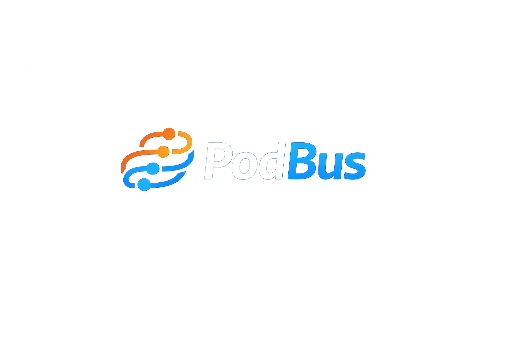

<p align="center">
  
</p>

<p align="center">
  <strong>Transport-aware messaging and durable jobs for Dart and Serverpod.</strong><br />
  Shared application contracts without pretending that different brokers provide identical guarantees.
</p>

<p align="center">
  <a href="https://github.com/eukalpia/PodBus/actions/workflows/ci.yml"></a>
  <a href="https://github.com/eukalpia/PodBus/actions/workflows/pub-validation.yml"></a>
  <a href="https://github.com/eukalpia/PodBus/actions/workflows/compatibility.yml"></a>
  <a href="https://github.com/eukalpia/PodBus/actions/workflows/security.yml"></a>
  <a href="LICENSE"></a>
  
  
  
</p>

PodBus is a Dart toolkit for message-driven services. It provides a common API for publish/subscribe, request/reply, durable workers, retries, dead letters, typed payloads, health checks, observability, PostgreSQL reliability primitives, and optional Serverpod integration.

The abstraction stops where broker semantics diverge. Applications can inspect transport capabilities at startup instead of discovering an unsupported guarantee after deployment.

PodBus is **not a broker**. It runs on top of NATS, RabbitMQ, Kafka, and PostgreSQL-backed reliability primitives.

> [!IMPORTANT]
> PodBus `0.1.0-beta.1` is a public beta candidate. NATS Core and JetStream are the reference transports. RabbitMQ is suitable for controlled production evaluation. Kafka remains experimental. Public APIs may change before `1.0.0`.

> [!WARNING]
> Broker-backed workers use at-least-once delivery. PodBus does not claim exactly-once external side effects. Make handlers and externally visible operations idempotent.

## What is included

- NATS Core publish/subscribe and request/reply
- NATS JetStream durable workers
- RabbitMQ publisher confirms, mandatory routing, retries, and dead-letter queues
- Experimental Kafka producers and consumer groups through native `librdkafka` bindings
- Typed JSON codecs with explicit message types and schema versions
- PostgreSQL transactional outbox, inbox leases, and persistent idempotency
- W3C trace-context propagation, Prometheus metrics, structured logs, and health probes
- Serverpod lifecycle and per-message session helpers
- Bounded concurrency, payload limits, graceful shutdown, and transport health reporting

## Packages

| Package | Responsibility | Maturity |
| --- | --- | --- |
| `podbus_core` | Contracts, codecs, policies, limits, and in-memory implementations | beta |
| `podbus_nats` | NATS Core and JetStream adapters | beta/reference |
| `podbus_rabbitmq` | RabbitMQ messaging and durable workers | beta |
| `podbus_kafka` | Kafka adapter and native `librdkafka` bindings | experimental |
| `podbus_postgres` | Transactional outbox, inbox leases, persistent idempotency | beta |
| `podbus_observability` | Tracing, Prometheus metrics, JSON logs, health probes | beta |
| `podbus_serverpod` | Serverpod lifecycle and session integration | beta |

The packages are prepared for pub.dev but are **not published yet**. Until the beta is published, use a reviewed Git commit or branch and pin it for reproducible builds.

```yaml
dependencies:
  podbus_core:
    git:
      url: https://github.com/eukalpia/PodBus.git
      ref: release/0.1.0-beta.1
      path: packages/podbus_core
  podbus_nats:
    git:
      url: https://github.com/eukalpia/PodBus.git
      ref: release/0.1.0-beta.1
      path: packages/podbus_nats
```

After publication, installation becomes:

```bash
dart pub add podbus_core
dart pub add podbus_nats
```

## Quick start

Start NATS with JetStream enabled:

```bash
docker run --rm \
  -p 4222:4222 \
  -p 8222:8222 \
  nats:2.10 -js -m 8222
```

Publish an event and consume it through a queue group:

```dart
import 'package:podbus_core/podbus_core.dart';
import 'package:podbus_nats/podbus_nats.dart';

Future<void> main() async {
  final bus = NatsMessageBus(
    config: NatsMessagingConfig(
      servers: [Uri.parse('nats://localhost:4222')],
    ),
  );

  await bus.connect();

  final subscription = await bus.subscribe<Map<String, Object?>>(
    'lead.created',
    queueGroup: 'crm-workers',
    concurrency: 8,
    handler: (context, lead) async {
      print('received lead ${lead['id']}');
    },
  );

  await bus.publish(
    'lead.created',
    {'id': 42, 'email': 'lead@example.com'},
    headers: MessageHeaders(correlationId: 'request-42'),
  );

  await subscription.close();
  await bus.close();
}
```

## Durable jobs

JetStream and RabbitMQ implement the `DurableJobQueue` contract. A worker acknowledges a job only after the handler completes successfully.

```dart
final jobs = NatsJetStreamJobQueue(
  config: NatsMessagingConfig(
    servers: [Uri.parse('nats://localhost:4222')],
    jetStream: const NatsJetStreamConfig(
      enabled: true,
      streamName: 'PODBUS_JOBS',
      subjects: ['jobs.>'],
    ),
  ),
);

await jobs.connect();

await jobs.worker<Map<String, Object?>>(
  'jobs.email.welcome',
  durableName: 'welcome-email-v1',
  concurrency: 8,
  retryPolicy: RetryPolicy(
    maxAttempts: 5,
    initialDelay: const Duration(milliseconds: 250),
    maxDelay: const Duration(seconds: 30),
    jitter: 0.2,
  ),
  deadLetterPolicy: const DeadLetterPolicy(
    enabled: true,
    destination: 'jobs.email.welcome.dead',
  ),
  handler: (context, job) async {
    await sendWelcomeEmail(job['email']! as String);
  },
);
```

Retries and dead-letter publication complete before the source message is acknowledged, terminated, or committed. This protects delivery state; it does not make arbitrary business side effects exactly-once.

## Choosing a transport

| Capability | In-memory | NATS Core | NATS JetStream | RabbitMQ | Kafka |
| --- | :---: | :---: | :---: | :---: | :---: |
| Publish / subscribe | ✓ | ✓ | — | ✓ | ✓ |
| Queue groups | ✓ | ✓ | — | ✓ | consumer groups |
| Request / reply | ✓ | ✓ | — | — | — |
| Durable workers | test only | — | ✓ | ✓ | ✓ |
| Delayed retry | process local | — | broker NAK | TTL / DLX | — |
| Dead-letter handling | ✓ | — | ✓ | ✓ | ✓ |
| Manual acknowledgement or commit | — | — | ✓ | ✓ | ✓ |

Use `capabilities` as the runtime source of truth:

```dart
queue.capabilities.requireAll({
  MessagingCapability.durableJobs,
  MessagingCapability.deadLettering,
  MessagingCapability.gracefulShutdown,
});
```

## Delivery and consistency

| Concern | PodBus behavior |
| --- | --- |
| Handler success | acknowledge or commit after the handler returns |
| Handler failure | classify, retry, or dead-letter according to policy |
| Duplicate delivery | application-level idempotency or a shared inbox store |
| Database write plus publish | PostgreSQL transactional outbox |
| Ordering | determined by the selected broker and partitioning strategy |
| Exactly-once side effects | not claimed |

Treat idempotency keys, durable consumer names, and message schemas as persistent data contracts rather than implementation details.

See [Reliability](docs/reliability.md), [Production deployment](docs/production.md), [Incident runbook](docs/runbook.md), and [Upgrade guide](docs/upgrading.md).

## Development

```bash
dart pub get
dart format --output=none --set-exit-if-changed .
dart analyze .
dart test \
  packages/podbus_core/test \
  packages/podbus_nats/test \
  packages/podbus_rabbitmq/test \
  packages/podbus_kafka/test \
  packages/podbus_postgres/test \
  packages/podbus_observability/test \
  packages/podbus_serverpod/test \
  --exclude-tags=integration
```

Run broker-backed tests locally:

```bash
docker compose -f docker-compose.integration.yaml up -d nats rabbitmq kafka postgres

PODBUS_RUN_INTEGRATION_TESTS=true dart test \
  packages/podbus_nats/test \
  packages/podbus_rabbitmq/test \
  packages/podbus_kafka/test \
  packages/podbus_postgres/test \
  --tags=integration
```

Validate all pub.dev archives without publishing:

```bash
dart run tool/publish_packages.dart --dry-run
```

Actual publication is deliberately separate and guarded. It will be performed only after the beta PR is green and reviewed.

## Contributing

Read [CONTRIBUTING.md](CONTRIBUTING.md) before opening a pull request. Changes to delivery semantics, wire formats, or durable consumer behavior should include failure-oriented tests, not only happy-path coverage.

## Security

Report vulnerabilities through [SECURITY.md](SECURITY.md). Do not disclose security issues in a public issue.

## License

PodBus is licensed under the [Apache License 2.0](LICENSE).
